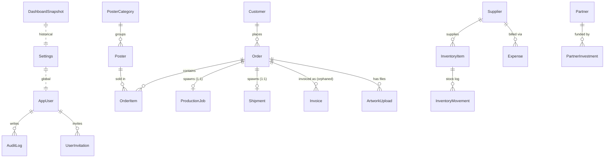
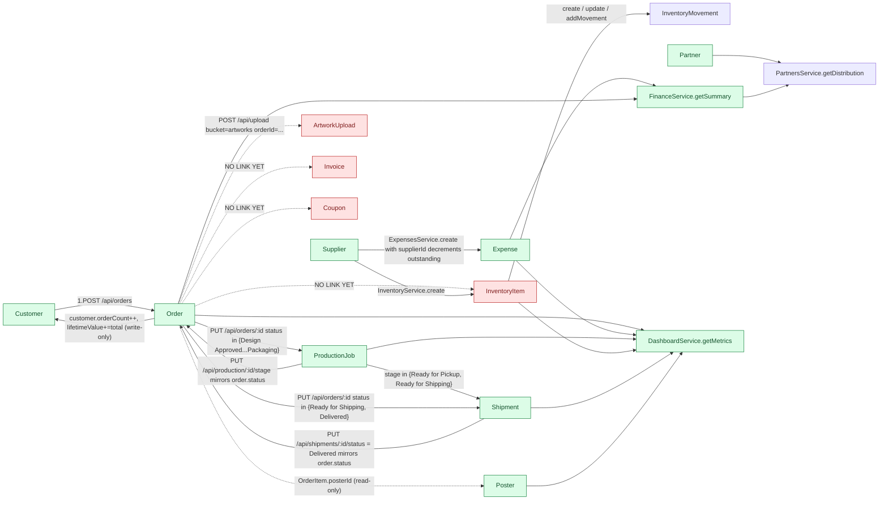
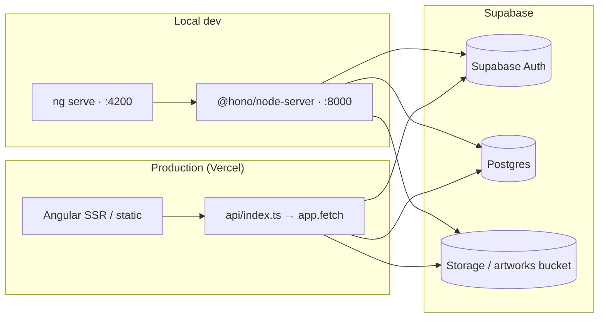

# KPrints ERP — Module Dependency Map

> **Discovery audit.** Read-only inventory of every frontend route, backend route group, Prisma entity, and the relationships between them as they exist in the current codebase. This is the source of truth for downstream Playwright workflow tests and the final production-readiness audit.
>
> **How to read this doc:** modules are grouped by domain. For each module you get UI route → backend route → service → Prisma entity → dependent entities. Workflow side effects (which module mutates which entity) live in [`workflow-map.md`](workflow-map.md). Known gaps live in [`missing-functionality-report.md`](missing-functionality-report.md).

---

## 1. Module Inventory & Status Classification

Status legend:

- **FULL** — frontend page, backend routes, Prisma model, and CRUD operations are all wired end-to-end.
- **PARTIAL** — at least one of {frontend, backend, model, CRUD operation} is incomplete or stubbed.
- **STATIC** — frontend renders, but no backend / no persistence (placeholder UX).
- **DEAD** — referenced by code/routes/nav but never reachable in practice or never used.

| # | Module | Frontend Route | Page Component | Backend Mount | Backing Service | Primary Entities | Status |
|---|---|---|---|---|---|---|---|
| 1 | **dashboard** | `/dashboard` | `DashboardPage` | `/api/dashboard`, `/api/dashboard/signals` | `DashboardService` | `Order`, `Expense`, `ProductionJob`, `Shipment`, `InventoryItem`, `Poster`, `DashboardSnapshot` | FULL |
| 2 | **orders** | `/orders` | `OrdersPage` | `/api/orders` | `OrdersService` | `Order`, `OrderItem`, `Customer`, `ProductionJob`, `Shipment` | FULL (no inventory linkage — see gaps) |
| 3 | **customers** | `/customers` | `CustomersPage` | `/api/customers` | `CustomersService` | `Customer` | FULL |
| 4 | **catalog** (posters) | `/catalog` | `CatalogPage` | `/api/posters` | `PostersService` | `Poster`, `PosterCategory`, `OrderItem` (sales rollup) | FULL — `soldThisMonth` is computed from `OrderItem`, `stock` is **never auto-decremented** |
| 5 | **inventory** | `/inventory` | `InventoryPage` | `/api/inventory` | `InventoryService` | `InventoryItem`, `InventoryMovement`, `Supplier` | FULL (manual movements only) |
| 6 | **production** | `/production` | `ProductionPage` | `/api/production` | `ProductionService` | `ProductionJob`, `Order`, `Shipment` | FULL |
| 7 | **print-queue** | `/print-queue` | `PrintQueuePage` | (reuses `/api/production/:id/stage`, `/:id/operator`) | `ProductionService` | `ProductionJob` | FULL — UI subset of production |
| 8 | **shipments** | `/shipments` | `ShipmentsPage` | `/api/shipments` | `ShipmentsService` | `Shipment`, `Order` | FULL |
| 9 | **artwork-uploads** | `/artwork-uploads` | `ArtworkUploadsPage` | `/api/artworks` (list), `/api/upload` (POST) | `ArtworksService`, upload handler | `ArtworkUpload`, `Order`, Supabase Storage (`artworks` bucket) | PARTIAL — no DELETE endpoint, no audit log on upload |
| 10 | **finance** | `/finance` | `FinancePage` | `/api/finance/summary`, `/api/partners`, `/api/partners/distribution`, `/api/monthly-metrics` | `FinanceService`, `PartnersService` | `Order`, `Expense`, `Partner`, `PartnerInvestment`, `DashboardSnapshot` | FULL (summary + partners; no AR/AP) |
| 11 | **purchases** | `/purchases` | `PurchasesPage` | (reuses `/api/expenses`) | `ExpensesService` | `Expense`, `Supplier` | PARTIAL — frontend wrapper on expenses; no dedicated purchase order entity |
| 12 | **vendors** | `/vendors` | `VendorsPage` | `/api/suppliers` | `SuppliersService` | `Supplier`, `Expense`, `InventoryItem` | FULL — "vendors" UI is a rename of suppliers API |
| 13 | **coupons** | `/coupons` | `CouponsPage` | `/api/coupons` | `CouponsService` | `Coupon` | FULL CRUD, but **never applied to any `Order`** — no FK, no business logic |
| 14 | **reports** | `/reports`, `/reports/financial-statements` | `ReportsPage`, `FinancialStatementsPage` | `/api/reports/export`, `/api/reports/financial/{quarterly,pnl,balance-sheet,cash-flow}` | `QuarterlyResultsService`, `ProfitLossService`, `BalanceSheetService`, `CashFlowService` | `Order`, `Expense`, `Customer`, `InventoryItem` | FULL — CSV export only covers 4 modules (customers, inventory, expenses, orders) |
| 15 | **settings** | `/settings` | `SettingsPage` | `/api/setup/status`, `/api/setup/demo`, `/api/setup/fresh` | `SetupService` | `Settings`, **all entities (destructive)** | FULL — DESTRUCTIVE: `/setup/fresh` and `/setup/demo` wipe DB |
| 16 | **admin/users** | `/admin/users` | `UsersPage` | `/api/users`, `/api/invitations`, `/api/audit-logs` | `UsersService`, `AuditLogsService` | `AppUser`, `UserInvitation`, `AuditLog` | FULL |
| 17 | **auth** | `/auth/login`, `/auth/forgot-password`, `/auth/reset-password`, `/auth/accept-invite`, `/auth/invite`, `/auth/verify-email`, `/auth/callback`, `/auth/pending-approval`, `/auth/invite-required`, `/auth/profile-unavailable`, `/auth/account-disabled`, `/auth/unauthorized`, `/auth/session-expired` | `LoginPage`, `ForgotPasswordPage`, `ResetPasswordPage`, `AcceptInvitePage`, `InvitePage`, `VerifyEmailPage`, `CallbackPage`, `AuthStatusPage` (×6 status variants) | `/api/auth/me`, `/api/auth/sync-profile`, Supabase Auth | (Hono auth routes), Supabase Auth | `AppUser`, `UserInvitation`, Supabase `auth.users` | FULL |
| 18 | **`:module` fallback** (any unmatched module) | `/<unknown>` | `OperationPage` | (reuses orders/shipments/suppliers/expenses) | `ErpDataService` | varies | DEAD/STATIC — generic placeholder; not reachable from `NAV_GROUPS` |
| 19 | **welcome / startup** | `/welcome` | `StartupPage` | `/api/setup/status` | `SetupService` | `Settings` | FULL |

### Modules referenced in code but not directly navigable

- **`PosterCategory`** — Prisma model + FK on `Poster.categoryId`, but no CRUD UI; seeded only via demo data. Posters have a string `category` field used by the catalog UI; the FK relation is unused in practice.
- **`Invoice`** — Prisma model with relation to `Order`, but **no `/api/invoices` route**, no service, no UI. Pure schema-only entity. (Confirmed via `app.ts` route registration.)
- **`DashboardSnapshot`** — written only by `SetupService.initializeDemo()`; read as historical fallback by `FinanceService.getMonthlyMetrics()` when no live data exists. Not editable.

---

## 2. RBAC Surface (single source of truth)

Backend RBAC: [`backend/src/auth/role-access.ts`](../../backend/src/auth/role-access.ts).
Frontend mirror: [`frontend/src/app/core/auth/auth.constants.ts`](../../frontend/src/app/core/auth/auth.constants.ts).
Navigation: [`frontend/src/app/core/navigation/nav.config.ts`](../../frontend/src/app/core/navigation/nav.config.ts).

| Module key | SUPER_ADMIN | ADMIN | MANAGER | STAFF | DESIGNER | PRODUCTION_OPERATOR | FINANCE | VIEWER |
|---|---|---|---|---|---|---|---|---|
| dashboard | RW | RW | RW | R | R | R | R | R |
| orders | RW | RW | RW | RW | R | R | R | R |
| customers | RW | RW | RW | RW | R | R | R | R |
| catalog | RW | RW | RW | RW | R | R | R | R |
| production | RW | RW | RW | R | R | RW | R | R |
| print-queue | RW | RW | RW | R | R | RW | R | R |
| inventory | RW | RW | RW | R | R | RW | R | R |
| shipments | RW | RW | RW | R | R | RW | R | R |
| artwork-uploads | RW | RW | R | R | RW | R | R | R |
| finance | RW | RW | R | R | R | R | RW | R |
| purchases | RW | RW | R | R | R | R | RW | R |
| vendors | RW | RW | R | R | R | R | RW | R |
| coupons | RW | RW | R | R | R | R | RW | R |
| reports | RW | RW | R | R | R | R | RW | R |
| settings | RW | RW | R | – | – | – | – | R |
| upload | RW | RW | RW | RW | RW | RW | R | R |
| setup | RW | – | – | – | – | – | – | – |
| admin/users | RW | – | – | – | – | – | – | – |

**Auth bypass:** Header `X-App-Mode: demo` short-circuits both `requireModuleAccess` and `requireModuleWrite` in [`role-access.ts`](../../backend/src/auth/role-access.ts) (`if (c.get('isDemo')) return next();`). **RBAC E2E suite must NOT use demo mode.**

**Audit-log access:** `/api/audit-logs/*` further requires `requireRole('SUPER_ADMIN')` on top of `protect('admin/users')`.

---

## 3. Prisma Entity Graph

Source of truth: [`backend/prisma/schema.prisma`](../../backend/prisma/schema.prisma).

### Entity → Owning module → Mutation surface

| Entity | Owning module | Created by (services) | Updated by (services) | Cascade behavior |
|---|---|---|---|---|
| `AppUser` | admin/users | `auth.routes.ts` (sync-profile), `SetupService` (indirect) | `UsersService.{approve,deactivate,updateRole}` | — |
| `UserInvitation` | admin/users | `UsersService.createInvitation` | `UsersService.{resendInvitation,acceptInvitation}` | deleted on `revokeInvitation` |
| `AuditLog` | admin/users | `AuditService.log` (orders, customers, inventory, expenses, users) | — | — |
| `Customer` | customers | `CustomersService.create`, `SetupService` | `CustomersService.update`, `OrdersService.create` (orderCount, lifetimeValue) | `Order` FK protects — no cascade |
| `PosterCategory` | catalog | `SetupService` only | (no UI) | `Poster.categoryId` nullable |
| `Poster` | catalog | `PostersService.create`, `SetupService` | `PostersService.update` | `OrderItem.posterId` nullable on delete |
| `Order` | orders | `OrdersService.create`, `SetupService` | `OrdersService.update`, `ProductionService.updateStage`, `ShipmentsService.updateStatus` | cascades to `OrderItem`, `ProductionJob`, `Shipment`, `Invoice`, `ArtworkUpload` |
| `OrderItem` | orders | `OrdersService.create` (nested), `SetupService` | — | cascades from `Order` |
| `Supplier` | vendors | `SuppliersService.create`, `SetupService` | `SuppliersService.update`, `ExpensesService.create` (outstanding decrement when supplierId is set) | `InventoryItem` + `Expense` FK protect |
| `InventoryItem` | inventory | `InventoryService.create`, `SetupService` | `InventoryService.update`, `InventoryService.addMovement` | cascades to `InventoryMovement` |
| `InventoryMovement` | inventory | `InventoryService.{create (initial), update (delta), addMovement}` | — | cascades from `InventoryItem` |
| `Expense` | purchases | `ExpensesService.create`, `SetupService` | (no update endpoint) | — |
| `ProductionJob` | production | `OrdersService.{create,update}` (auto on prod-stage statuses), `SetupService` | `ProductionService.updateStage`, `ProductionService.assignOperator`, `OrdersService.update` | cascades from `Order` |
| `Shipment` | shipments | `OrdersService.update` (auto on shipping statuses), `ProductionService.updateStage` (Ready for Pickup/Shipping), `ShipmentsService.create`, `SetupService` | `ShipmentsService.updateStatus` (also mirrors `Order.status` to `Delivered`) | cascades from `Order` |
| `Coupon` | coupons | `CouponsService.create`, `SetupService` | `CouponsService.update` | — (no FK referenced anywhere) |
| `Partner` | finance | `PartnersService.create`, `SetupService` | `PartnersService.update` | cascades to `PartnerInvestment` |
| `PartnerInvestment` | finance | `PartnersService.{addInvestment}`, `SetupService` | `PartnersService.updateInvestment` | cascades from `Partner` |
| `Invoice` | (orphaned — no module) | `SetupService` only? (none currently — model is unused at runtime) | — | cascades from `Order` |
| `ArtworkUpload` | artwork-uploads | `/api/upload` handler when `bucket=artworks` and `orderId` present, `SetupService` | — (no update/delete) | cascades from `Order` |
| `DashboardSnapshot` | dashboard | `SetupService.initializeDemo` only | — | — |
| `Settings` | settings | `SetupService.initializeFresh`, `SetupService.initializeDemo` | — (recreated, never updated) | — |

---

## 4. Cross-Module Dependency Diagram (workflow flow)

Dotted edges = the schema implies a relationship that is **not yet implemented in business logic**. These are the headline integration gaps captured in `missing-functionality-report.md`.

---

## 5. Frontend ↔ Backend Endpoint Crosswalk

> Every backend route is listed exactly once; the column "Used by" lists every frontend feature that calls it (best-effort, based on file grep + route module). Routes not used by any frontend are flagged.

### Authentication

| Method | Path | Used by | Notes |
|---|---|---|---|
| GET | `/api/auth/me` | `core/services/auth.service.ts` | Returns current `AppUser` |
| POST | `/api/auth/sync-profile` | login + invite flow | Provisions `AppUser` from Supabase user + invitation |

### Users & Admin

| Method | Path | Used by | Notes |
|---|---|---|---|
| GET | `/api/users` | `admin/users` page | Lists `AppUser` + pending invitations merged |
| GET | `/api/users/:id` | (unused by current UI) | |
| PATCH | `/api/users/:id/approve` | `admin/users` page | |
| PATCH | `/api/users/:id/deactivate` | `admin/users` page | Self-deactivation blocked |
| PATCH | `/api/users/:id/role` | `admin/users` page | Self-role-change blocked |
| GET | `/api/invitations/validate?token=` | `auth/accept-invite` page | Public |
| GET | `/api/invitations` | `admin/users` page | SUPER_ADMIN only via RBAC on `admin/users` |
| POST | `/api/invitations` | `admin/users` page | |
| POST | `/api/invitations/:id/resend` | `admin/users` page | |
| DELETE | `/api/invitations/:id` | `admin/users` page | |
| GET | `/api/audit-logs` | `admin/users` page (audit-logs tab) | Requires `SUPER_ADMIN` |

### Setup (DESTRUCTIVE — settings UI)

| Method | Path | Used by | Notes |
|---|---|---|---|
| GET | `/api/setup/status` | `settings`, `startup-page` | Public, safe |
| POST | `/api/setup/demo` | `settings` page | **DESTRUCTIVE — wipes DB then seeds demo** |
| POST | `/api/setup/fresh` | `settings` page | **DESTRUCTIVE — wipes DB and inits empty** |

### Customers

| Method | Path | Used by | Notes |
|---|---|---|---|
| GET/POST/PUT/DELETE | `/api/customers[/:id]` | `customers` page, `orders` page (linked customer picker) | Audited on create/update/delete |

### Posters (catalog)

| Method | Path | Used by | Notes |
|---|---|---|---|
| GET/POST/PUT/DELETE | `/api/posters[/:id]` | `catalog` page, `orders` page (line items), `dashboard` (top-selling) | Sales are derived from `OrderItem.quantity` |

### Inventory

| Method | Path | Used by | Notes |
|---|---|---|---|
| GET/POST/PUT/DELETE | `/api/inventory[/:id]` | `inventory` page | Audited |
| POST | `/api/inventory/:id/movements` | `inventory` page (manual movements) | Audited |

### Orders

| Method | Path | Used by | Notes |
|---|---|---|---|
| GET/POST/PUT/DELETE | `/api/orders[/:id]` | `orders` page, `artwork-uploads` page (order picker), `dashboard` | Audited |

### Production / Print Queue

| Method | Path | Used by | Notes |
|---|---|---|---|
| GET | `/api/production[/:id]` | `production`, `print-queue` pages | |
| PUT | `/api/production/:id/stage` | `production`, `print-queue` pages | Mirrors `Order.status`; auto-creates `Shipment` |
| PUT | `/api/production/:id/operator` | `production`, `print-queue` pages | **No audit log** |

### Shipments

| Method | Path | Used by | Notes |
|---|---|---|---|
| GET | `/api/shipments` | `shipments` page, dashboard | |
| POST | `/api/shipments` | `shipments` page | |
| PUT | `/api/shipments/:id/status` | `shipments` page | Mirrors `Order.status` if `Delivered` — **no audit log** |

### Expenses (used by both Purchases and Finance UI)

| Method | Path | Used by | Notes |
|---|---|---|---|
| GET/POST/DELETE | `/api/expenses[/:id]` | `purchases` page, `finance` page | No PUT endpoint (cannot edit). Audited on create/delete |

### Dashboard

| Method | Path | Used by | Notes |
|---|---|---|---|
| GET | `/api/dashboard` | `dashboard` page | KPIs + monthly metrics + signals |
| GET | `/api/dashboard/signals` | `dashboard` page (notifications, timeline) | |

### Upload (Supabase Storage)

| Method | Path | Used by | Notes |
|---|---|---|---|
| POST | `/api/upload` | `artwork-uploads`, possibly settings/avatar | Only writes `ArtworkUpload` row when `bucket=artworks` & `orderId` provided. **No audit log** |

### Reports

| Method | Path | Used by | Notes |
|---|---|---|---|
| GET | `/api/reports/export?module=` | `reports` page | CSV; modules = `customers`, `inventory`, `expenses`, `orders` (default) |
| GET | `/api/reports/financial/quarterly` | `financial-statements` page | |
| GET | `/api/reports/financial/pnl` | `financial-statements` page | |
| GET | `/api/reports/financial/balance-sheet` | `financial-statements` page | |
| GET | `/api/reports/financial/cash-flow` | `financial-statements` page | |

### Suppliers (Vendors UI)

| Method | Path | Used by | Notes |
|---|---|---|---|
| GET/POST/PUT/DELETE | `/api/suppliers[/:id]` | `vendors` page | Protected as module `vendors`. **No audit log** |

### Coupons

| Method | Path | Used by | Notes |
|---|---|---|---|
| GET/POST/PUT/DELETE | `/api/coupons[/:id]` | `coupons` page | **Coupon never applied to any order** — see gap report. No audit log |

### Artworks

| Method | Path | Used by | Notes |
|---|---|---|---|
| GET | `/api/artworks` | `artwork-uploads` page | List only — no create/update/delete |

### Partners

| Method | Path | Used by | Notes |
|---|---|---|---|
| GET | `/api/partners` | `finance` page | |
| GET | `/api/partners/distribution` | `finance` page | Derived from `FinanceService.getSummary` + `Partner.profitSharePercent` |
| GET | `/api/partners/:id` | (unused?) | |
| POST/PUT/DELETE | `/api/partners[/:id]` | `finance` page | Enforces total ≤ 100%. **No audit log** |
| POST/PUT/DELETE | `/api/partners/:id/investments[/:investmentId]` | `finance` page | **No audit log** |

### Finance

| Method | Path | Used by | Notes |
|---|---|---|---|
| GET | `/api/finance/summary` | `finance` page, `dashboard` (indirect via service composition) | |
| GET | `/api/monthly-metrics` | `finance` page, `dashboard`, `reports` | Falls back to `DashboardSnapshot` then `FinanceService.getSummary` if no live data |

---

## 6. Audit-Log Coverage Snapshot

Used downstream by the DB-validation suite to assert mutations leave evidence.

| Module | Action | Audited? | Source |
|---|---|---|---|
| customers | create / update / delete | ✅ | `customers.routes.ts` |
| orders | create / update / delete | ✅ | `orders.routes.ts` |
| inventory | create / update / delete / movement | ✅ | `inventory.routes.ts` |
| expenses | create / delete | ✅ | `expenses.routes.ts` |
| users | approve / deactivate / role_change / invite / invite_resend / invite_revoke / login | ✅ | `users.service.ts`, `auth.routes.ts` |
| posters | create / update / delete | ❌ | not wired |
| suppliers (vendors) | create / update / delete | ❌ | not wired |
| coupons | create / update / delete | ❌ | not wired |
| partners | create / update / delete / investment changes | ❌ | not wired |
| production | stage change / operator assignment | ❌ | not wired |
| shipments | create / status change | ❌ | not wired |
| upload | artwork upload | ❌ | not wired |
| setup | demo / fresh | ❌ | not wired (and these are destructive) |

This list informs **RBAC** and **DB-validation** test design — any mutation surface lacking an audit log is either a gap to fix or a deliberate omission to document.

---

## 7. Environment & Deployment Boundaries

**Backend entrypoint:** `backend/src/app.ts` exports the Hono `app`. Locally it self-serves via `@hono/node-server`; on Vercel `api/index.ts` invokes `app.fetch` directly. There is **one** backend codebase, two deployment targets.

**Demo-mode header:** `X-App-Mode: demo` is set by the frontend `app-mode` storage flag and accepted server-side as a full RBAC bypass. The setup demo endpoint also accepts unauthenticated calls (`protectSetupDemo()` is more permissive than `protectSetupMutation()`).

---

## 8. Implications for E2E Test Architecture

1. **Single Prisma client = single DB** at any time per backend process → the test suite must run against a dedicated Supabase TEST project. `wipeDatabase()` is **only safe** if `DATABASE_URL` points at the TEST project — guard accordingly.
2. **Workflow tests must triangulate** UI ↔ API ↔ DB for every transition because three different services (`OrdersService`, `ProductionService`, `ShipmentsService`) can mutate `Order.status`, and they don't all keep `ProductionJob.stage` in sync (see workflow map).
3. **RBAC tests cannot rely on demo header.** Use 8 authenticated personas and assert both `403` from API and the `/auth/unauthorized` redirect from UI.
4. **Audit-log assertions are partial.** Don't assert audit rows on production/shipments/uploads/posters/coupons until those gaps are closed (see backlog in missing-functionality-report.md).
5. **`/api/setup/fresh` and `/api/setup/demo` must never run against production.** CI: guard with explicit env check before invoking.
6. **Order → inventory linkage is missing.** Workflow tests should explicitly cover the "happy path without inventory" today, and flip to "with inventory decrement" once the gap is closed.

