# KPrints ERP — Business Workflow Map

> **Discovery audit.** Read-only catalogue of every cross-module workflow as currently coded. Each workflow is documented as a state machine with the explicit DB side effects the service layer performs. This document is the contract Playwright workflow tests will assert against.
>
> See companion docs: [`dependency-map.md`](dependency-map.md) (module/entity inventory), [`missing-functionality-report.md`](missing-functionality-report.md) (what's missing, ordered by severity).

---

## 1. Canonical `Order.status` Lifecycle

`Order.status` is the **central state field** in the system. It is mutated by three different services and the same string value is mirrored to `ProductionJob.stage`. The same enum-shaped string is referenced from three places:

- Validator: [`backend/src/modules/production/production.routes.ts`](../../backend/src/modules/production/production.routes.ts) `stageUpdateSchema`
- Branch logic: [`backend/src/modules/orders/orders.service.ts`](../../backend/src/modules/orders/orders.service.ts)
- Print Queue filter: [`frontend/src/app/features/print-queue/pages/print-queue-page/print-queue-page.ts`](../../frontend/src/app/features/print-queue/pages/print-queue-page/print-queue-page.ts)

### Allowed status values (production stage enum)

```
Draft
Design Pending
Design Approved
Printing Queued
Printing In Progress
Lamination
Framing
Packaging
Ready for Pickup
Ready for Shipping
Delivered
Cancelled
```

### Status state machine (intended happy path)

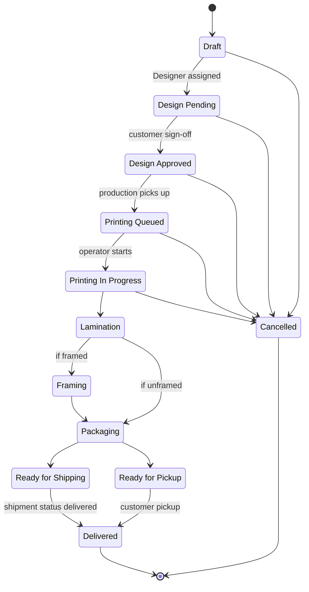

**Currently the code does NOT enforce these transitions** — `PUT /api/orders/:id` and `PUT /api/production/:id/stage` accept any value in the enum from any prior value. Workflow tests must therefore assert _side effects_, not transition legality. Closing this is a workflow / API-contract candidate fix.

---

## 2. Workflow W1 — Create Customer

**UI:** `customers` page → "New Customer" dialog.
**API:** `POST /api/customers`.

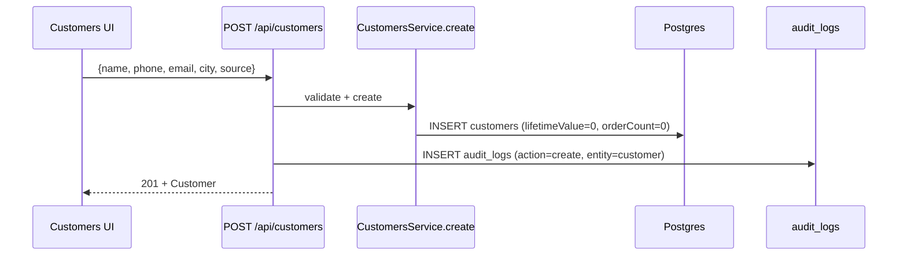

**Assertions for workflow + DB-validation tests**

| Layer | Expectation |
|---|---|
| UI | New row visible in customers table; default `lifetimeValue=0`, `orderCount=0` |
| API | `GET /api/customers/:id` returns body matching POST input |
| DB | `customers` row exists; `audit_logs` row with `action=create, entity=customer` |
| RBAC | Forbidden for DESIGNER / PRODUCTION_OPERATOR / FINANCE / VIEWER (POST returns 403) |

---

## 3. Workflow W2 — Create Order (the core flow)

**UI:** `orders` page → "New Order" dialog.
**API:** `POST /api/orders` (transactional).
**Source:** [`backend/src/modules/orders/orders.service.ts`](../../backend/src/modules/orders/orders.service.ts) lines 86–161.

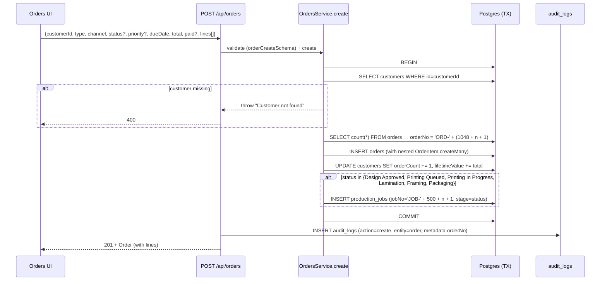

**Critical observations**

- `orderNo` and `jobNo` are derived from `count(*)`. **Not concurrency-safe** under bursty load (two parallel creates race to the same number). API contract tests should attempt a small concurrent burst and assert uniqueness.
- `OrderItem.posterId` is optional; orders for custom designs leave it null.
- **No inventory side effect.** `Poster.stock` is not decremented, and no `InventoryMovement` is logged. (See [`missing-functionality-report.md`](missing-functionality-report.md#G1).)
- **No coupon discount applied.** `total` is whatever the UI computed.
- The auto-create-production-job branch only fires for the listed stages — orders created at `Draft` / `Design Pending` do **not** get a `ProductionJob` until they advance.

**Assertions for workflow + DB-validation tests**

| Layer | Expectation |
|---|---|
| UI | New order in table with generated `orderNo` |
| API | `GET /api/orders/:id` returns `lines`, optionally `productionJob` |
| DB | `orders` row, `order_items` rows, `customers.orderCount` +1, `customers.lifetimeValue` += `total`, `production_jobs` row only if status was in the prod-stages list |
| DB (gap) | No `inventory_movements` row, no `Poster.stock` decrement, no `Invoice` row |
| Audit | `audit_logs` row with `action=create, entity=order, metadata.orderNo` |
| RBAC | Forbidden for DESIGNER / PRODUCTION_OPERATOR / FINANCE / VIEWER |

---

## 4. Workflow W3 — Advance Order Status (cross-service cascade)

**UI:** `orders` page → edit dialog, or `production` page → kanban drag, or `print-queue` → stage dialog.
**APIs:**
- `PUT /api/orders/:id` — used by Orders UI
- `PUT /api/production/:id/stage` — used by Production + Print Queue UIs

Both write to `Order.status` and `ProductionJob.stage`, but **with subtly different side-effect chains**.

### 4a. `PUT /api/orders/:id` path

Source: [`OrdersService.update`](../../backend/src/modules/orders/orders.service.ts) lines 163–264.

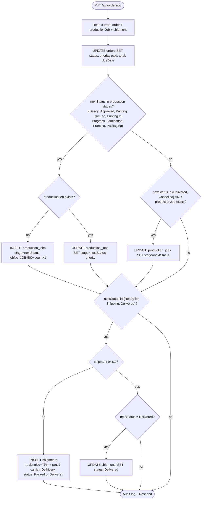

### 4b. `PUT /api/production/:id/stage` path

Source: [`ProductionService.updateStage`](../../backend/src/modules/production/production.service.ts) lines 56–97.

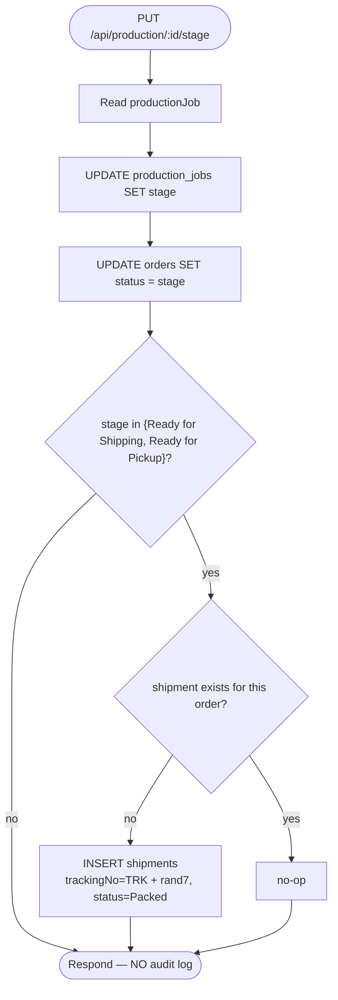

### Behavioural differences between the two paths

| Concern | Orders PUT | Production PUT |
|---|---|---|
| Mirrors the counterpart status | YES (creates/updates `ProductionJob`) | YES (writes `orders.status = stage`) |
| Auto-creates shipment | On `Ready for Shipping` or `Delivered` | On `Ready for Shipping` or **`Ready for Pickup`** |
| Marks existing shipment Delivered | YES (when status → `Delivered`) | NO (production never moves shipment past `Packed`) |
| Audit log written | YES (`audit.log`) | **NO** |
| Cancellation handling | Closes `ProductionJob.stage = 'Cancelled'` if it exists | No special handling |

**Implication:** these two APIs are **not idempotent siblings**. Tests must cover both paths separately and assert that the resulting DB state converges on the same end state. The audit-log gap in `ProductionService` is captured in the missing-functionality report.

### Side-effect matrix — `Order.status` transitions

| New status | OrdersService.update side effects | ProductionService.updateStage side effects |
|---|---|---|
| `Draft`, `Design Pending` | order updated; if `productionJob` exists, **not touched** | order updated; no shipment; no audit |
| `Design Approved` | order updated; productionJob upserted; shipment **not** touched | order updated; productionJob.stage updated; no shipment; no audit |
| `Printing Queued` | same as above | same as above |
| `Printing In Progress` | same as above | same as above |
| `Lamination` | same as above | same as above |
| `Framing` | same as above | same as above |
| `Packaging` | same as above | same as above |
| `Ready for Pickup` | order updated; productionJob is **NOT** updated (Orders branch doesn't include this stage in `productionStages`) — **drift bug** | order updated; productionJob.stage updated; shipment created if missing; no audit |
| `Ready for Shipping` | order updated; productionJob upserted; shipment created (status=Packed) | order updated; productionJob.stage updated; shipment created (status=Packed); no audit |
| `Delivered` | order updated; productionJob.stage updated to Delivered; shipment created if missing or marked Delivered | order updated; productionJob.stage updated; shipment **NOT** touched (drift if it already exists) |
| `Cancelled` | order updated; productionJob.stage updated to Cancelled; shipment not touched | order updated; productionJob.stage updated; shipment not touched (drift) |

> **Gap callout:** `Ready for Pickup` via Orders PUT leaves `ProductionJob.stage` stale, and `Delivered` via Production PUT leaves `Shipment.status` stale. Either fix the service code or document in the readiness report. Workflow tests should explicitly drive the workflow via the Production kanban (primary UX) and assert UI/API/DB consistency.

---

## 5. Workflow W4 — Shipment Status Update

**UI:** `shipments` page → status dropdown / dialog.
**API:** `PUT /api/shipments/:id/status` — source [`ShipmentsService.updateStatus`](../../backend/src/modules/shipments/shipments.service.ts).

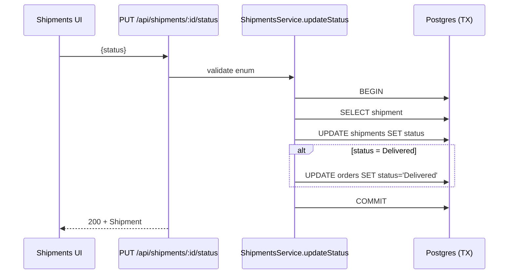

**Allowed statuses:** `Packed | In Transit | Out for Delivery | Delivered | Delayed`.

**Side-effects matrix**

| Shipment status | orders.status | production_jobs.stage | audit_logs |
|---|---|---|---|
| Packed | unchanged | unchanged | — |
| In Transit | unchanged | unchanged | — |
| Out for Delivery | unchanged | unchanged | — |
| Delivered | **set to `Delivered`** | **unchanged (drift)** | — (no audit) |
| Delayed | unchanged | unchanged | — |

**Implication for tests:** asserting "shipment delivered ⇒ order delivered" is safe; asserting "shipment delivered ⇒ production job delivered" is **not** safe today.

---

## 6. Workflow W5 — Inventory Movement

**UI:** `inventory` page → manual movement dialog (Purchase / Consumption / Adjustment).
**API:** `POST /api/inventory/:id/movements`.
**Auto-creation:** `InventoryService.create` and `InventoryService.update` also record movements when stock quantity changes.

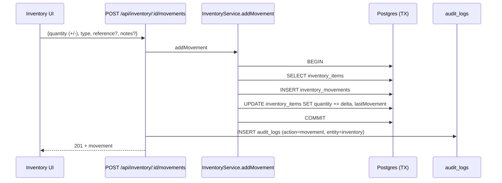

**Notes**

- Quantity is signed: positive for `Purchase` / positive adjustment, negative for `Consumption` / negative adjustment.
- `reorderLevel` is read-only here; the dashboard's `lowStockItems` check is `quantity <= reorderLevel`.
- **Not yet triggered by any order workflow** — the only writers are the inventory page and SetupService seed (see gap G1).

---

## 7. Workflow W6 — Expense / Purchase Record

**UI:** `purchases` page (and `finance` page also reads expenses).
**API:** `POST /api/expenses` (no PUT — expenses cannot be edited).

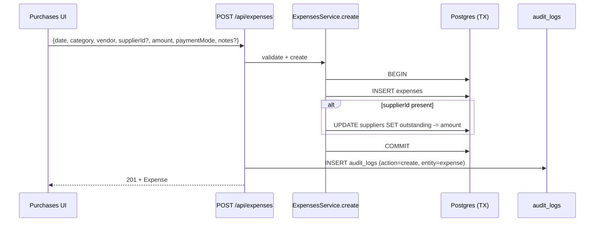

**Side-effect callouts**

- `supplier.outstanding` is **decremented unconditionally**. There is no validation that `outstanding` was previously ≥ amount; outstanding can go negative.
- Deleting an expense via `DELETE /api/expenses/:id` does **not** roll back the supplier outstanding decrement.

---

## 8. Workflow W7 — Artwork Upload

**UI:** `artwork-uploads` page → "Upload" dialog (file + order picker).
**API:** `POST /api/upload` with `multipart/form-data` (`file`, `bucket=artworks`, `orderId`).

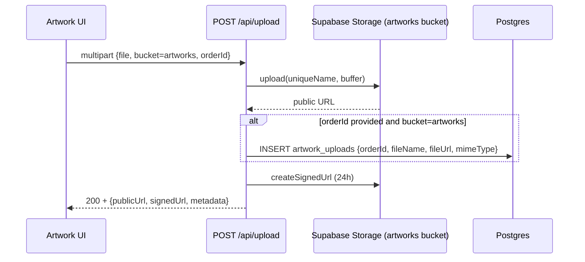

**Observations**

- `metadata.fileName` stores the original client filename; the storage path uses `${Date.now()}-${rand4}.${ext}` to avoid collisions.
- **No audit log entry.**
- **No delete endpoint** (`/api/artworks` is list-only). Deleting an order cascade-deletes the row but **leaves the storage object orphaned** in Supabase Storage.
- The list endpoint joins `order` (orderNo, customerName, status) for display.

---

## 9. Workflow W8 — User Invitation Lifecycle

**UI:** `admin/users` page → "Invite" button.
**APIs:** `POST /api/invitations`, `GET /api/invitations/validate?token=`, `POST /api/auth/sync-profile`.

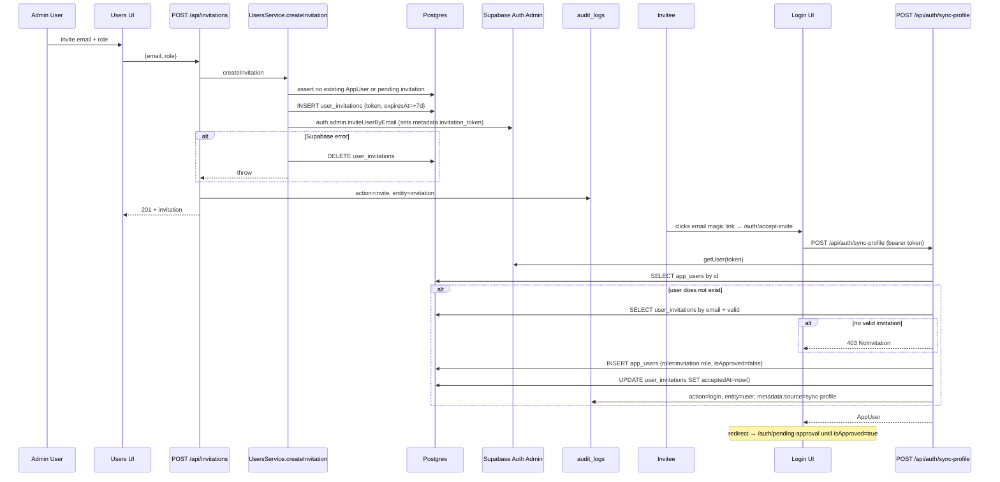

**Edge cases captured in service code**

- `USER_EXISTS` → 409 if an `AppUser` already exists for the email.
- `INVITE_PENDING` → 409 if there's already a non-expired, non-accepted invitation.
- Resend (`POST /api/invitations/:id/resend`) extends `expiresAt` by another 7 days and re-sends the Supabase invite. Audit `invite_resend`.
- Revoke (`DELETE /api/invitations/:id`) refuses if the invitation has been accepted or the user is already onboarded; otherwise also deletes the Supabase auth row. Audit `invite_revoke`.
- A self-acted user (acceptInvitation runs in `sync-profile`) starts with `isApproved=false`, so the `approvalGuard` will redirect to `/auth/pending-approval` until SUPER_ADMIN approves via `PATCH /api/users/:id/approve`.

---

## 10. Workflow W9 — Dashboard Aggregation

**UI:** `dashboard` page (auto-loaded on shell entry).
**API:** `GET /api/dashboard?period=...`.
**Source:** [`DashboardService.getMetrics`](../../backend/src/modules/dashboard/dashboard.service.ts).

Side-effect: **read-only**. The dashboard never mutates data.

### Reads

| Widget / metric | Source query |
|---|---|
| `revenue`, `collected`, `profit`, `orderCount` | `FinanceService.getSummary` → `prisma.order.findMany` (period) + `prisma.expense.findMany` (period) |
| `expenses` | as above |
| `pendingPrintJobs` | `prisma.productionJob.count` where stage not in `{Delivered, Cancelled}` |
| `inventoryAlerts` | `prisma.inventoryItem.findMany` filtered to `quantity <= reorderLevel` |
| `topPosters` | `PostersService.getTopSelling(period, 4)` — sums `OrderItem.quantity` per poster |
| `recentOrders` | `prisma.order.findMany` orderBy createdAt desc, take 5 |
| `productionPipeline` | `prisma.productionJob.groupBy(stage)` |
| `shipmentStats` | `prisma.shipment.groupBy(status)` |
| `monthlyMetrics` | `FinanceService.getMonthlyMetrics` — live data, then `DashboardSnapshot` fallback |
| `notifications` (signals) | derived from unassigned prod jobs, low-stock items, packed shipments, profit-margin month-over-month |
| `activityTimeline` (signals) | merged stream of recent prod jobs, recent orders, low-stock items, recent deliveries |

### Dashboard test pattern

After each workflow step in W2–W7, hit `GET /api/dashboard` and assert the relevant widget changed by the expected delta (e.g., creating an order should bump `revenue` by `order.total`, `orderCount` by 1, and either add to `pipeline['Design Pending']` or whatever stage was used).

---

## 11. Workflow W10 — Finance / Partner Distribution

**UI:** `finance` page → partner section.
**APIs:** `GET /api/finance/summary`, `GET /api/partners`, `GET /api/partners/distribution`, `POST /api/partners`, `PUT /api/partners/:id`, `POST /api/partners/:id/investments`.

### Distribution computation

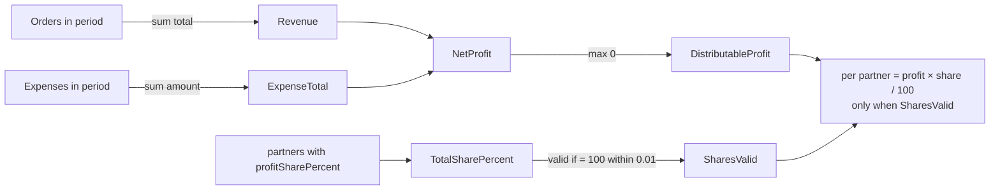

**Invariants the test suite must assert**

- Sum of `profitSharePercent` across partners ≤ 100 (`PartnersService.assertProfitSharesDoNotExceed100`)
- If sum ≠ 100 exactly (±0.01), `sharesValid=false` and **all partner cuts are 0** (not pro-rated)
- `distributableProfit = max(0, revenue - expenses)` — a loss yields zero distribution, not negative

---

## 12. Workflow W11 — Authentication Lifecycle

**UI:** all `/auth/*` pages.
**APIs:** Supabase Auth (`signInWithPassword`, `resetPasswordForEmail`, `signOut`, ...) + `/api/auth/me`, `/api/auth/sync-profile`.

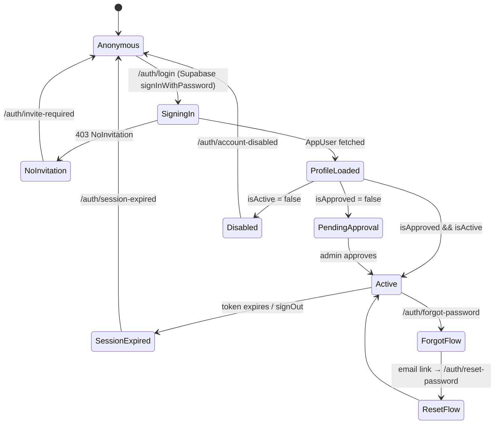

**Guards in play (frontend)**

- `guestGuard` blocks signed-in users from seeing login / forgot-password.
- `authGuard` requires an authenticated Supabase session.
- `approvalGuard` redirects unapproved users to `/auth/pending-approval`.
- `roleGuard` checks the route's `data.module` against `ROLE_ACCESS`.

**Authentication test matrix**

| Scenario | Expected UX |
|---|---|
| Valid credentials, approved + active user | redirect to last-attempted route or `/dashboard` |
| Valid credentials, isApproved=false | redirect to `/auth/pending-approval` |
| Valid credentials, isActive=false | redirect to `/auth/account-disabled` |
| Valid Supabase auth but no invitation | redirect to `/auth/invite-required` |
| Bad password | inline form error |
| Forgot password → email → reset | password updated, login succeeds |
| Accept-invite flow | new `AppUser` with role from invitation, `isApproved=false` |
| Session expiry mid-session (token refresh fails) | redirect to `/auth/session-expired` |
| Role-forbidden route navigation | redirect to `/auth/unauthorized` |
| Sign-out | session cleared, `/auth/login` reachable |

---

## 13. Workflow W12 — Coupon Management (orphaned)

**UI:** `coupons` page (CRUD).
**API:** `/api/coupons` CRUD.

**Side effects:** none. Coupons are stored but **never consulted by any order or finance flow**. `Order.total` is whatever the UI computes; there is no FK or denormalised field linking a coupon to an order or order line.

UX-feedback / error-handling backlog: either implement coupon → order discount or document as "metadata-only".

---

## 14. Workflow W13 — Setup / Reset (DESTRUCTIVE)

**UI:** `settings` page (SUPER_ADMIN only via RBAC).
**APIs:** `POST /api/setup/demo`, `POST /api/setup/fresh`.

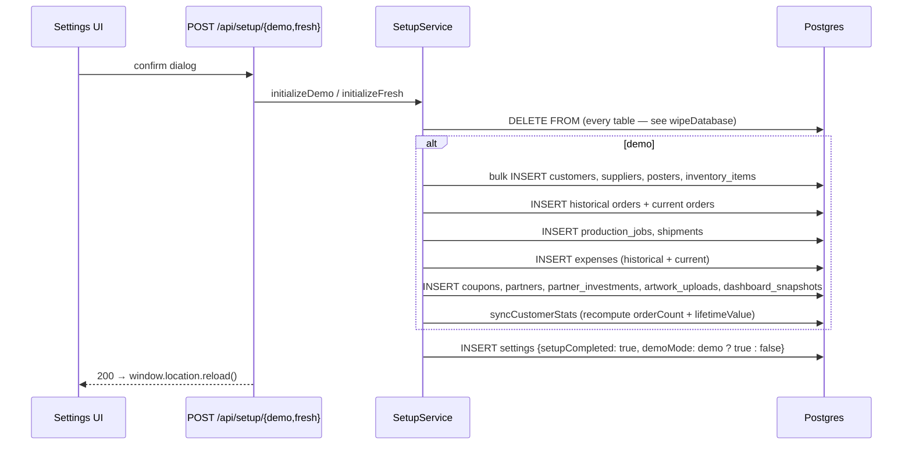

**Tables wiped (in order):** `order_items, production_jobs, shipments, invoices, artwork_uploads, orders, inventory_movements, inventory_items, expenses, coupons, partner_investments, partners, suppliers, customers, posters, poster_categories, dashboard_snapshots, settings`.

**NOT wiped:** `app_users`, `user_invitations`, `audit_logs` — these survive a setup reset. This is by design (auth survives), but DB-validation tests should explicitly cover the "reset preserves users + audit history" property.

**Test policy**

- These endpoints must run **only** against TEST DB. The Playwright global setup will gate on `DATABASE_URL` matching the TEST project, and CI will inject the TEST secret.
- The "smoke prod" job must explicitly skip every test file under `e2e/tests/` that calls `/api/setup/*` or the wipe helpers.

---

## 15. Cross-Module Effect Matrix (one-glance summary)

Read horizontally: "if I trigger this action, what changes?"

| Trigger | `orders` | `order_items` | `production_jobs` | `shipments` | `customers` | `inventory_items` | `inventory_movements` | `posters` | `expenses` | `suppliers` | `artwork_uploads` | `audit_logs` |
|---|---|---|---|---|---|---|---|---|---|---|---|---|
| `POST /api/customers` | — | — | — | — | INSERT | — | — | — | — | — | — | INSERT |
| `POST /api/orders` (status not prod stage) | INSERT | INSERT (nested) | — | — | UPDATE counters | — | — | — | — | — | — | INSERT |
| `POST /api/orders` (status in prod stages) | INSERT | INSERT (nested) | INSERT | — | UPDATE counters | — | — | — | — | — | — | INSERT |
| `PUT /api/orders/:id` (→ prod stage) | UPDATE | — | UPSERT | — | — | — | — | — | — | — | — | INSERT |
| `PUT /api/orders/:id` (→ Ready for Shipping) | UPDATE | — | UPSERT | INSERT or noop | — | — | — | — | — | — | — | INSERT |
| `PUT /api/orders/:id` (→ Delivered) | UPDATE | — | UPDATE (stage=Delivered) | INSERT or UPDATE(status=Delivered) | — | — | — | — | — | — | — | INSERT |
| `PUT /api/orders/:id` (→ Cancelled) | UPDATE | — | UPDATE (stage=Cancelled if exists) | — | — | — | — | — | — | — | — | INSERT |
| `DELETE /api/orders/:id` | DELETE (cascade) | DELETE (cascade) | DELETE (cascade) | DELETE (cascade) | **NOT decremented (gap)** | — | — | — | — | — | DELETE (cascade) | INSERT |
| `PUT /api/production/:id/stage` (→ prod stage) | UPDATE (mirror) | — | UPDATE | — | — | — | — | — | — | — | — | **— (gap)** |
| `PUT /api/production/:id/stage` (→ Ready for Pickup or Shipping) | UPDATE (mirror) | — | UPDATE | INSERT if missing | — | — | — | — | — | — | — | — (gap) |
| `PUT /api/production/:id/operator` | — | — | UPDATE | — | — | — | — | — | — | — | — | — (gap) |
| `POST /api/shipments` | — | — | — | INSERT | — | — | — | — | — | — | — | — (gap) |
| `PUT /api/shipments/:id/status` (→ Delivered) | UPDATE (status=Delivered) | — | — (drift) | UPDATE | — | — | — | — | — | — | — | — (gap) |
| `POST /api/inventory` | — | — | — | — | — | INSERT | INSERT (if quantity > 0) | — | — | — | — | INSERT |
| `PUT /api/inventory/:id` (quantity change) | — | — | — | — | — | UPDATE | INSERT (delta) | — | — | — | — | INSERT |
| `POST /api/inventory/:id/movements` | — | — | — | — | — | UPDATE (quantity) | INSERT | — | — | — | — | INSERT |
| `POST /api/expenses` (no supplierId) | — | — | — | — | — | — | — | — | INSERT | — | — | INSERT |
| `POST /api/expenses` (with supplierId) | — | — | — | — | — | — | — | — | INSERT | UPDATE outstanding | — | INSERT |
| `DELETE /api/expenses/:id` | — | — | — | — | — | — | — | — | DELETE | **NOT rolled back (gap)** | — | INSERT |
| `POST /api/upload` (orderId + artworks bucket) | — | — | — | — | — | — | — | — | — | — | INSERT | — (gap) |
| `POST /api/posters` | — | — | — | — | — | — | — | INSERT | — | — | — | — (gap) |
| `POST /api/coupons` | — | — | — | — | — | — | — | — | — | — | — | — (gap) |
| `POST /api/suppliers` | — | — | — | — | — | — | — | — | — | INSERT | — | — (gap) |
| `POST /api/partners` | — | — | — | — | — | — | — | — | — | — | — | — (gap) |
| `POST /api/setup/demo` | DELETE then bulk INSERT | DELETE then bulk INSERT | DELETE then bulk INSERT | DELETE then bulk INSERT | DELETE then bulk INSERT | DELETE then bulk INSERT | DELETE then re-INSERT | DELETE then bulk INSERT | DELETE then bulk INSERT | DELETE then bulk INSERT | DELETE then bulk INSERT | — (gap — destructive op not audited) |

Cells marked **gap** flag known issues from [`missing-functionality-report.md`](missing-functionality-report.md).

---

## 16. Cross-Module End-to-End Happy-Path Scenario (E2E spec target)

The master workflow test will drive this sequence and assert at every step via UI + API + DB.

```mermaid
sequenceDiagram
  participant UI
  participant API
  participant DB

  Note over UI,DB: Step 1 — Seed prerequisites
  UI->>API: POST /api/customers {TEST_CUSTOMER_001}
  API->>DB: INSERT customers
  UI->>API: POST /api/posters {TEST_POSTER_001}
  API->>DB: INSERT posters
  UI->>API: POST /api/suppliers {TEST_SUPPLIER_001}
  API->>DB: INSERT suppliers
  UI->>API: POST /api/inventory {TEST_INVENTORY_001 supplier=TEST_SUPPLIER_001}
  API->>DB: INSERT inventory_items + initial movement

  Note over UI,DB: Step 2 — Place order
  UI->>API: POST /api/orders {customerId=TEST_CUSTOMER_001, lines=[poster=TEST_POSTER_001 qty=2], status='Design Pending'}
  API->>DB: INSERT orders + order_items; UPDATE customer (orderCount=1, lifetimeValue=total); audit_logs+
  Note right of DB: NO production_job yet (status not in prod stages)

  Note over UI,DB: Step 3 — Designer approves
  UI->>API: PUT /api/orders/{id} status='Design Approved'
  API->>DB: UPDATE orders; INSERT production_jobs; audit_logs+

  Note over UI,DB: Step 4 — Upload artwork
  UI->>API: POST /api/upload {bucket=artworks, orderId=order.id, file=fixture.png}
  API->>DB: INSERT artwork_uploads
  Note right of API: storage object created; NO audit log

  Note over UI,DB: Step 5 — Production progresses
  UI->>API: PUT /api/production/{jobId}/operator {operator='qa-production-operator'}
  API->>DB: UPDATE production_jobs.operator
  UI->>API: PUT /api/production/{jobId}/stage stage='Printing In Progress'
  API->>DB: UPDATE production_jobs; UPDATE orders.status
  UI->>API: PUT /api/production/{jobId}/stage stage='Ready for Shipping'
  API->>DB: UPDATE production_jobs; UPDATE orders.status; INSERT shipments (carrier=Delhivery status=Packed)

  Note over UI,DB: Step 6 — Shipment delivered
  UI->>API: PUT /api/shipments/{shipId}/status {status='Delivered'}
  API->>DB: UPDATE shipments.status; UPDATE orders.status='Delivered'
  Note right of DB: drift — production_jobs.stage stays 'Ready for Shipping' (gap)

  Note over UI,DB: Step 7 — Record expense + dashboard assertion
  UI->>API: POST /api/expenses {supplierId=TEST_SUPPLIER_001, amount=…}
  API->>DB: INSERT expenses; UPDATE suppliers.outstanding; audit_logs+
  UI->>API: GET /api/dashboard
  API->>DB: aggregate
  API-->>UI: KPIs reflect 1 order revenue, 1 expense, 1 delivered shipment, 1 active job count = 0, low-stock unchanged

  Note over UI,DB: Step 8 — Triangulation
  UI->>API: GET /api/orders/{id}
  API-->>UI: includes lines, productionJob (Ready for Shipping), shipment (Delivered), artworks[1]
  UI->>API: GET /api/audit-logs?entity=order&entityId={id}
  API-->>UI: ≥ 2 entries (create + at least one update)
```

This scenario captures every documented happy-path side effect and explicitly surfaces the two known drift bugs — the test will assert them as **expected current behaviour** with a TODO marker to flip once fixes land.

